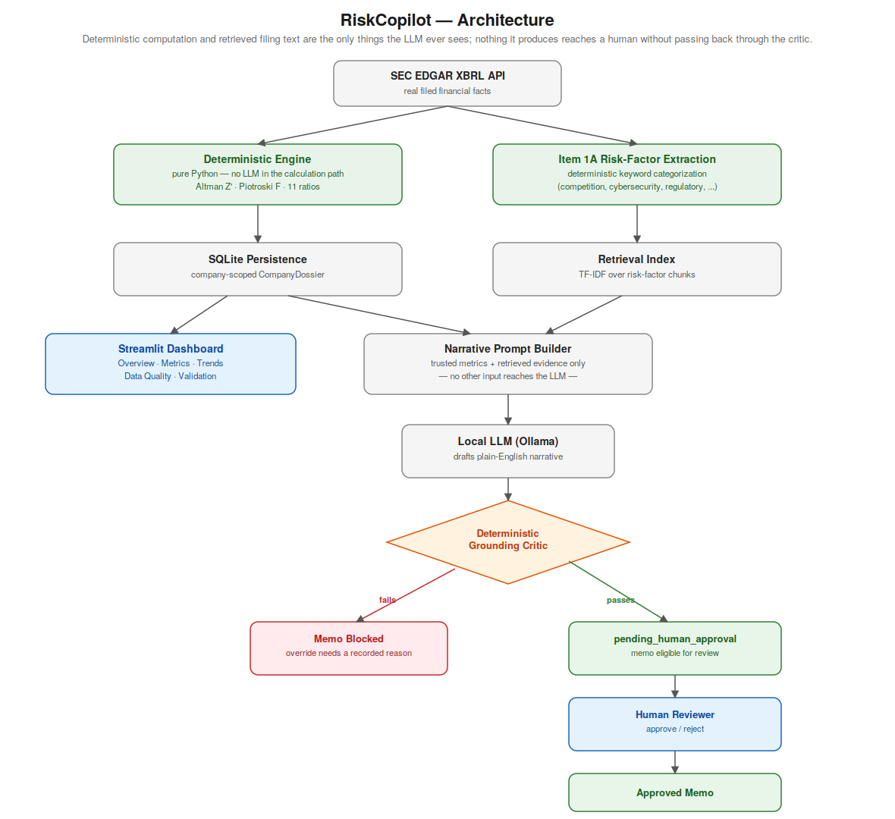

# RiskCopilot

**A company-agnostic financial risk intelligence platform that separates deterministic computation from AI-generated explanation.**

RiskCopilot computes credit-risk signals for any real US-listed company directly from that company's own SEC filings, and layers a governed AI explanation on top, one that is automatically checked for hallucinated numbers before a human ever reviews it.

---

## The Problem

Credit analysts, lenders, and investment committees still spend significant time manually reading 10-K filings to assess a company's financial health. Firms are now trying to speed this up with AI, but that introduces a serious new risk: large language models are fluent and confident, and they can state a plausible-sounding number that is simply wrong. In a credit or investment decision, an unverified figure is not a minor bug, it is a liability.

RiskCopilot is a working demonstration of how to get the speed benefit of AI without inheriting that risk: keep every number that matters under deterministic, auditable computation, and use AI only to explain, with a real verification layer standing between the AI's output and any human decision-maker.

## What RiskCopilot Does

Given any real US-listed company, entered as a ticker, CIK, or company name, RiskCopilot:

- Retrieves that company's actual filed financial data from the SEC EDGAR XBRL API
- Computes the **Altman Z'-Score** (bankruptcy risk) and **Piotroski F-Score** (fundamental strength) using plain, deterministic Python arithmetic
- Computes **11 financial ratios** across liquidity, leverage, profitability, and cash flow, each with full formula and source-value transparency
- Tracks **multi-year trends** for every metric, using only real stored fiscal years, never an interpolated or estimated data point
- Extracts and categorizes the company's own **SEC Item 1A risk-factor disclosures**
- Assigns a **deterministic overall risk tier** from a fixed, documented rule table, never an LLM judgment call
- Generates a **grounded AI risk narrative**, retrieval-based and checked line by line by a deterministic grounding critic before it can proceed
- Requires **human approval** before any AI-generated memo is considered final
- Includes a **historical backtest** against real corporate bankruptcies, with its statistical limitations disclosed rather than hidden

When required filing data is missing or ambiguous for a given company and year, RiskCopilot reports "insufficient data" rather than estimating or fabricating a value.

## Why This Is Different From a Typical "AI Wrapper"

Three architectural decisions separate this from a demo that simply calls an LLM and hopes for the best:

**Computation and generation are hard-separated.** Every financial score is computed by deterministic Python logic directly from parsed SEC filing facts. The LLM is never in the calculation path, it only writes about numbers that were already computed and handed to it. This mirrors how regulated financial institutions are expected to treat model risk: a number that can be traced back to arithmetic and a filed document, not to a model's judgment.

**The verifier cannot itself hallucinate.** Most "AI with citations" systems trust the AI to cite itself correctly. RiskCopilot's grounding critic is deterministic, regex-based Python code, not a second LLM call, so its judgment about whether a claim is properly sourced is itself auditable and reproducible. It checks two things mechanically: that every citation in the narrative points to something that was actually retrieved or computed, and that every genuine numeric claim carries a citation, unless it is a verified restatement of a metric RiskCopilot itself already computed.

**Nothing reaches a decision without a human.** Every generated memo lands in a `pending_human_approval` state. A memo that fails the grounding critic is blocked from approval entirely unless a reviewer supplies an explicit, recorded override reason, it never silently becomes final.

## Architecture

```mermaid
flowchart TD
    A["SEC EDGAR XBRL API<br/>real filed financial facts"] --> B["Deterministic Engine<br/>(pure Python, no LLM)<br/>Altman Z' · Piotroski F · 11 ratios"]
    A --> C["Item 1A Risk-Factor Extraction<br/>+ keyword categorization<br/>(deterministic)"]
    B --> D["SQLite Persistence<br/>company-scoped CompanyDossier"]
    C --> E["Retrieval Index<br/>(TF-IDF over risk-factor chunks)"]
    D --> F["Streamlit Dashboard<br/>Overview · Metrics · Trends · Data Quality"]
    D --> G["Narrative Prompt Builder<br/>trusted metrics + retrieved evidence only"]
    E --> G
    G --> H["Local LLM (Ollama)<br/>drafts plain-English narrative"]
    H --> I{"Deterministic Grounding Critic<br/>checks every citation + numeric claim"}
    I -- "fails" --> J["Memo blocked<br/>(override requires a recorded reason)"]
    I -- "passes" --> K["pending_human_approval"]
    K --> L["Human Reviewer<br/>approve / reject"]
    L --> M["Approved Memo"]

    style B fill:#e8f4ea,stroke:#2e7d32
    style C fill:#e8f4ea,stroke:#2e7d32
    style I fill:#fff3e0,stroke:#e65100
    style L fill:#e3f2fd,stroke:#1565c0
```





The dashed line running through this diagram is the one that matters: everything left of the grounding critic is either deterministic computation or retrieved-verbatim filing text; the LLM only ever sees material that already passed through that boundary, and nothing it produces reaches a human reviewer without passing back through the critic first.

## Historical Validation

The Altman Z'-Score model was backtested against real corporate bankruptcies (Bed Bath & Beyond, Party City) using pre-event filing snapshots. It correctly flagged 3 of 4 snapshots as grey-zone or distressed ahead of the actual bankruptcy filing. This is an honest, small-sample result (N=2 companies), not a statistically powered accuracy claim, and the full methodology and its limitations are documented rather than glossed over.

## Data Integrity Guarantees

- **No cross-company contamination.** A single company-scoped `CompanyDossier` read path serves every section of the dashboard, so one company's data can never appear under another company's tab.
- **No hardcoded company list.** Apple, Microsoft, and NVIDIA are used throughout the repository as validation cases, not as a supported universe. The same unmodified code path analyzes any real US-listed company with SEC XBRL data.
- **No silent staleness.** A previously valid score that cannot be reproduced on the most recent recomputation is explicitly invalidated, never left on screen as if it were still current.

## Tech Stack

Python · Streamlit · SEC EDGAR XBRL · SQLite · Ollama (local LLM inference) · Retrieval-Augmented Generation · pytest

## Requirements

**System**
- Python 3.11 or later
- [Ollama](https://ollama.com) installed and running locally, for the AI narrative layer (a scripted offline demo mode is available without it, no download needed)
- Internet access, for fetching real filings from SEC EDGAR
- ~200 MB free disk space (the SQLite database and pulled Ollama model(s) are the main footprint; a small model such as `llama3.2` is enough)

**Python packages** (see `requirements.txt` for exact version ranges)

| Package | Purpose |
|---|---|
| `requests` | SEC EDGAR API calls, Ollama HTTP calls |
| `pydantic` | Typed data models for facts, scores, ratios, and the critic report |
| `python-dotenv` | Loads `SEC_EDGAR_USER_AGENT` from `.env` |
| `scikit-learn`, `numpy`, `scipy` | TF-IDF retrieval over Item 1A risk-factor text |
| `streamlit` | The dashboard itself |
| `pytest`, `pytest-cov` | Test suite |

No package is required for the LLM call itself, `OllamaLLMClient` talks to a local Ollama server over plain HTTP using `requests`, which is already listed above.

**Required configuration**

SEC EDGAR requires every API caller to identify itself. Set this in `.env` before running:

```
SEC_EDGAR_USER_AGENT="Your Name your_email@example.com"
```

## Quickstart

```bash
python -m venv .venv

# Windows
.venv\Scripts\activate

# macOS / Linux
source .venv/bin/activate

pip install -r requirements.txt
cp .env.example .env          # set SEC_EDGAR_USER_AGENT
python scripts/seed_dashboard_data.py
streamlit run dashboard.py
```

Then, in the dashboard, use "Analyze a new company" with any real US-listed ticker, it is not limited to the validation cases above.

## Documentation

Full architectural decision records, the historical backtest methodology, and the final verification report are in `docs/`. Every claim made in that documentation is backed by a command that was actually run against this codebase, not an assertion.

## Status

Complete and verified. Full test suite passing; see `docs/09_final_verification_report.md` for the complete verification trail.

